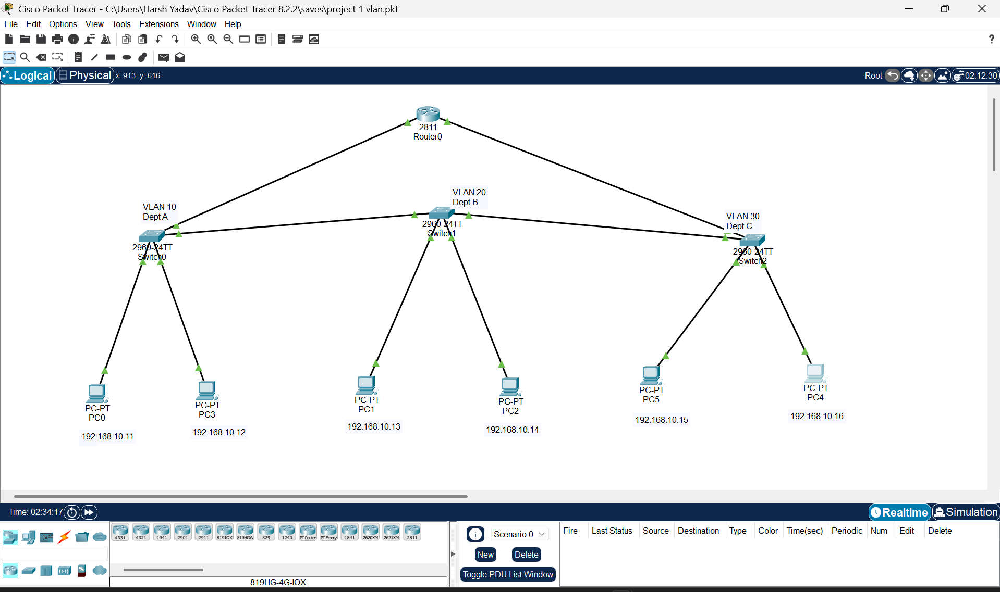

# 🔷 VLAN Configuration with Inter-VLAN Routing

## 📌 Overview
This project demonstrates VLAN segmentation and inter-VLAN communication using Cisco Packet Tracer. Multiple VLANs are created and connected using router-on-a-stick to enable communication between different departments.

## 🖥️ Network Topology

## ⚙️ Features
- VLAN creation and port assignment  
- Trunk configuration between switches  
- Inter-VLAN routing using router-on-a-stick  
- Connectivity verification using ICMP (ping)  

## 🛠️ Tech Stack
- Cisco Packet Tracer  
- VLAN (IEEE 802.1Q)  
- TCP/IP  
- Routing & Switching  

## 🎥 Demo Video
https://youtu.be/Dag6GWJk9JY

## 📊 Result
✔ Successful communication between VLAN 10, 20, and 30  
✔ Inter-VLAN routing verified using ping  

---

## 📁 Project Files

- [📥 Download Packet Tracer File](project1vlan.pkt)  
- [🖼️ View Network Topology](Topology.png)  

---

## 👨‍💻 Author
Harsh Yadav

